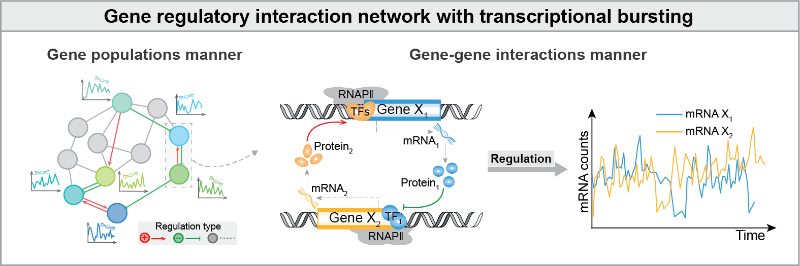
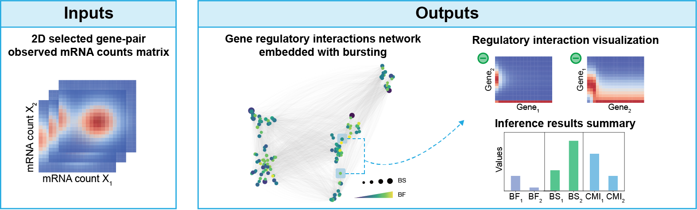

.. BurstLink documentation master file, created by
   sphinx-quickstart on Sat Nov 30 12:07:47 2024.
   You can adapt this file completely to your liking, but it should at least
   contain the root `toctree` directive.

Welcome to BurstLink's documentation!
=====================================

.. image:: https://img.shields.io/pypi/v/burstlink
   :target: https://pypi.org/project/burstlink/
   :alt: PyPI

.. image:: https://img.shields.io/pypi/pyversions/burstlink
   :target: https://pypi.org/project/burstlink/
   :alt: PyPI - Python Version

.. image:: https://img.shields.io/pypi/wheel/burstlink
   :target: https://pypi.org/project/burstlink/
   :alt: PyPI - Wheel

.. image:: https://img.shields.io/github/downloads/LiyingZhou12/BurstLink/total
   :target: https://github.com/LiyingZhou12/BurstLink/
   :alt: Downloads

**BurstLink** is a Python package to infer the coupled dynamics of gene regulatory interactions 
and transcriptional bursting from single-cell transcriptomics or multi-omics data. It contains 
many intuitive visualization and downstream analysis tools, providing a great practical toolbox 
for biomedical researchers.

Gene regulatory interactions dictate transcriptional bursting
=============================================================

Transcriptional bursts are inherently dynamic and stochastic processes, which are influenced by 
gene-gene regulatory interactions through transcription factors from other genes, ultimately 
driving highly heterogeneous gene expression within cells.  A question is to explore how dynamic 
gene-gene interaction-constructed regulatory network dictates bursting on a genome-wide scale. 

Inference workflow 
==================

BurstLink is a user-friendly package without the hyperparameter tuning, which is mainly utilized to infer 
coupled dynamics of gene regulatory interactions and transcriptional bursting, given scRNA-seq data of any 
two genes (screened by scATAC-seq data, optional). BurstLink enables gene-pair inference and supports rapid 
whole-genome inference and a series of downstream analyses.

New
===

- Jan 09, 2025: We released BurstLink version 1.0.3. This version standardizes function names and fixes some bugs.

BurstLink's features
====================

- BurstLink characterizes the coupled dynamics of gene regulatory interactions and transcriptional bursting in terms of 
  a tractable statistical distribution with interpretable parameters. 

- BurstLink has multiple visualization and downstream analysis tools to identify gene roles (TF, TG), explore the impact
  of gene regulatory loops on bursting, and investigate the TF binding kinetics on the genome-wide.

- The method can flexibly be applied to either scRNA-seq data or single-cell multi-omics data (scATAC-seq and scRNA-seq 
  data), meaning that vast amounts of existing data can be analyzed immediately for gene interactions and transcriptional
  bursting.

Reference
=========
BurstLink: a statistical mechanistic model to reveal global transcriptional dynamics with gene regulatory interactions from single-cell data.

.. toctree::
   :maxdepth: 2
   :caption: Contents

   installation
   tutorials/index
   api/index
